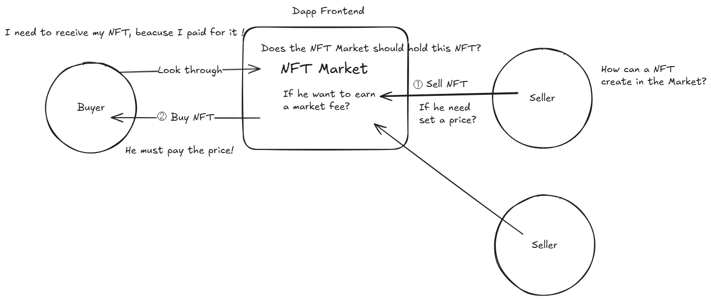

# Art Waves (Blockchain Developer position)
## NFT Marketplace Brief 


[ Three Roles ]
- I -> Seller
- M -> Marketplace
- Z -> Buyer

[ Create a token ]
- I mint a token, and transfer to market
- I -0.01 market fee, but set 0.05 price
- M Recieve this token
- M +0.01 market fee

[ Purchase a token ]
- Z purchase this token, paid 0.05
- M transfer this token to Z, transfer 0.01 market fee to Owner
- M Recieve 0.05, transfer 0.05 purchase fee to I(Seller)

So, in this process,

- The Owner of market earn the market fee.
- The Seller earn the price, and pay the market fee.
- The Buyer pay the price, and get the NFT which mint by seller.

## Makefile Commands

This project uses a `Makefile` to simplify common tasks. Below are the available commands:

Install dependencies with compatibility for legacy peer dependencies:

```sh
make install
```

Start the project:

```sh
make start
```

Clean Hardhat compiled files and cache:

```sh
make clean
```

Compile NFTMarketplace smart contract:

```sh
make build
```

Run NFTMarketplace smart contract tests:

```sh
make test
```

Start a local Hardhat blockchain node:

```sh
make node
```

Deploy smart contracts to the local Hardhat network:

```sh
make deploy_local
```

Deploy smart contracts to the Sepolia testnet:

```sh
make deploy_sepolia
```

Verify your contract:

```sh
npx hardhat verify --network sepolia <YOUR_CONTRACT_ADDRESS>
```

## Contact
For any issues or support, please contact me at opendev.top@gmail.com for remote assistance.
